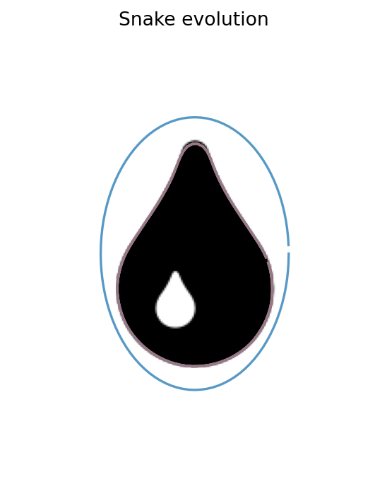
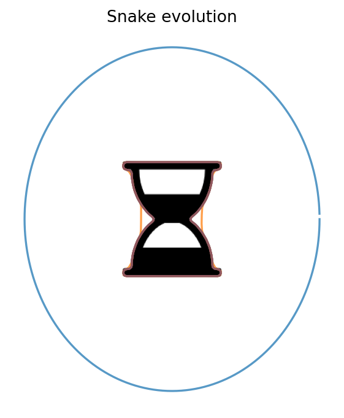
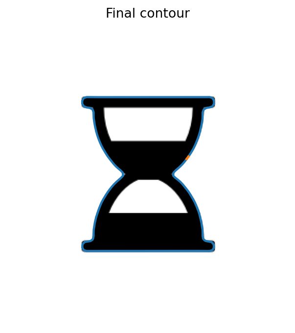
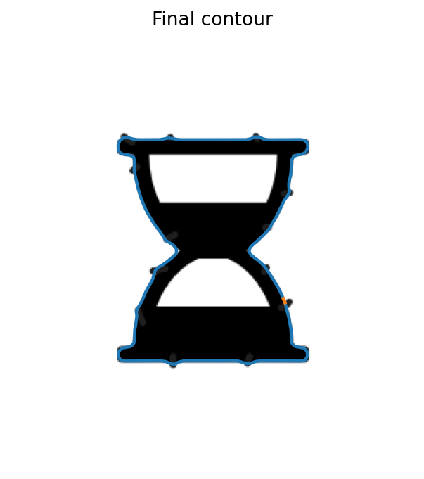

# Active Contour Segmentation

This project implements **active contour segmentation**, also known as **snake segmentation**, for boundary detection in grayscale images.

The objective is to study how a deformable contour can progressively move toward object boundaries by minimizing an energy that balances:

- attraction toward image edges,
- contour smoothness,
- contour rigidity,
- sensitivity to parameter choices.

For the detailed mathematical formulation of the snake energy, the internal/external forces, and the iterative optimization scheme, please refer to the project report.

---

## Project Goal

The goal of this project is to detect object boundaries using active contours and to analyze how the method behaves depending on:

- the shape of the object,
- the convexity of the object,
- the initialization of the contour,
- the values of the snake parameters,
- the presence of small visual perturbations around the object.

The project focuses on two main examples:

1. a **convex object**: a water droplet,
2. a **less convex object**: an hourglass shape.

---

## Method Overview

A snake is initialized as a rough contour around the object.  
During the optimization, the contour evolves iteratively under two types of forces:

### Internal forces

These forces control the geometry of the snake.

- `alpha` controls the elasticity of the contour.
- `beta` controls the curvature and smoothness of the contour.

A higher internal regularization makes the snake smoother and less flexible.

### External forces

These forces attract the contour toward image edges.

- `gamma` controls the strength of attraction toward the image contours.
- The external force is derived from the image gradient or an edge-based energy map.

The balance between internal and external forces determines whether the snake can accurately follow the real object boundary.

---

## Experiments

### 1. Convex object: water droplet

The first experiment is performed on a water droplet.  
This object is mostly convex and has a smooth external boundary.

The snake is expected to perform well because:

- the contour is simple,
- the boundary is smooth,
- the object has no strong concavities,
- the snake regularization naturally favors smooth shapes.

<p align="center">
  
</p>

<p align="center">
  <em>Snake evolution on a convex water droplet.</em>
</p>

---

### 2. Less convex object: hourglass

The second experiment is performed on an hourglass shape.  
This object is less convex and contains stronger local geometric variations.

This case is more challenging because the snake has to follow a boundary that is less smooth and less globally convex.

<p align="center">
  
</p>

<p align="center">
  <em>Snake evolution on a less convex hourglass shape.</em>
</p>

---

## Influence of Parameters

The experiments highlight the strong influence of the snake parameters.

### Alpha

`alpha` controls the tension of the contour.

- A low `alpha` allows the snake to deform more freely.
- A high `alpha` makes the snake more rigid and tends to shorten the contour.

### Beta

`beta` controls the curvature penalty.

- A low `beta` allows the snake to follow sharper variations.
- A high `beta` produces smoother contours but can prevent the snake from following concavities.

### Gamma

`gamma` controls the attraction toward image edges.

- A low `gamma` may prevent the snake from reaching the object boundary.
- A high `gamma` increases attraction toward edges, but may also make the contour more sensitive to noise or local artifacts.

### Time step and iterations

The time step controls how much the contour moves at each iteration.  
A large time step may cause instability or oscillations, while a smaller time step gives a smoother evolution but may require more iterations.

---

## Robustness Experiment: Hourglass with Black Filaments

To test whether the snake prediction is stable under small perturbations, black filaments were manually added around the hourglass object.

The goal was to check whether these external artifacts would significantly change the detected contour.

The experiment showed that the snake prediction remained approximately the same, meaning that the contour was mainly driven by the dominant object boundary rather than by small surrounding perturbations.

<p align="center">
  
</p>

<p align="center">
  <em>Snake result on the original hourglass image.</em>
</p>

<p align="center">
  
</p>

<p align="center">
  <em>Snake result on the hourglass image with added black filaments.</em>
</p>

---

## Key Observations

- The snake performs well on smooth and mostly convex shapes.
- Less convex shapes require more careful parameter tuning.
- Lower `alpha` and `beta` values make the contour more flexible.
- Higher `gamma` values increase attraction toward edges.
- Small external artifacts do not necessarily change the final contour if the main boundary remains dominant.
- The method is sensitive to initialization and parameter selection.

---

## Limitations

Active contours are not a universal segmentation method.

They work best when:

- the object has a visible boundary,
- the contrast between the object and the background is sufficient,
- the initial contour is reasonably close to the object,
- the object is not too concave or fragmented.

They may fail or require additional preprocessing when:

- the background is complex,
- the object has weak boundaries,
- there are many competing edges,
- the object has deep concavities,
- the initialization is too far from the true contour.

---

## Why Not Only Use a Gradient?

A simple gradient or edge detector can reveal where intensity changes occur, but it does not directly provide a clean, closed, regular object contour.

The snake adds a geometric constraint on top of edge detection:

- it produces a closed curve,
- it regularizes the contour,
- it balances edge attraction with smoothness,
- it provides a parametric representation of the boundary.

This is why active contours are useful when we want a clean and structured object boundary rather than only a raw edge map.

---

## Repository Structure

```bash
.
├── src/
│   ├── snake.py
│   ├── preprocessing.py
│   ├── initialization.py
│   ├── visualization.py
│   └── metrics.py
│
├── scripts/
│   └── run_snake.py
│
├── reports/
│   └── snake_report.pdf
│
└── README.md
```

---

## Usage

Example command:

```bash
cd src 

python ../scripts/run_snake.py \
  --input data/im_goutte.png \
  --output_dir ../results/drop_example \
  --init auto \
  --polarity dark \
  --iterations 1500
```

The script exports:

- the initial contour,
- the final contour,
- the snake evolution,
- the edge map,
- the final contour coordinates.

---

## Author

**Livio Singarin-Solé**
